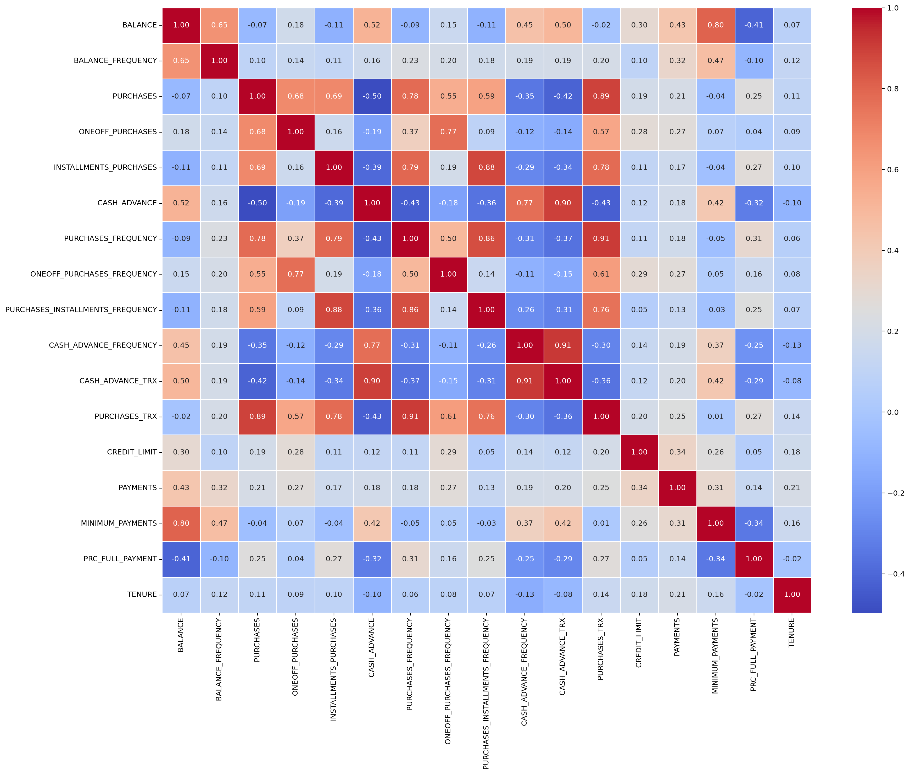
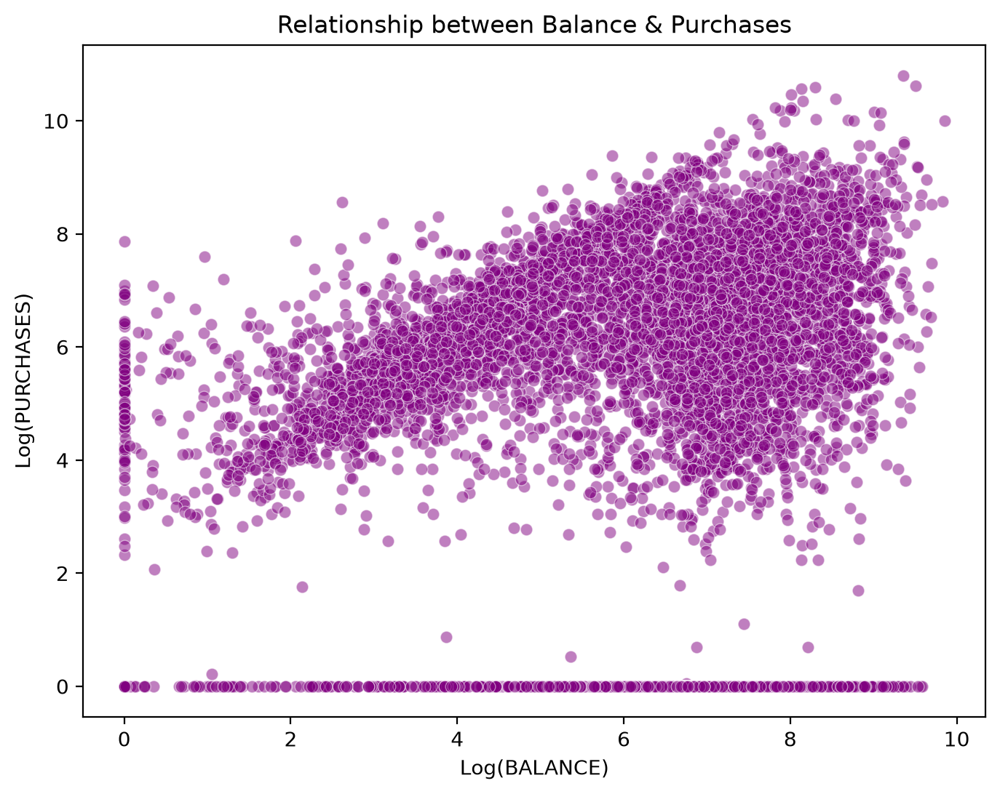
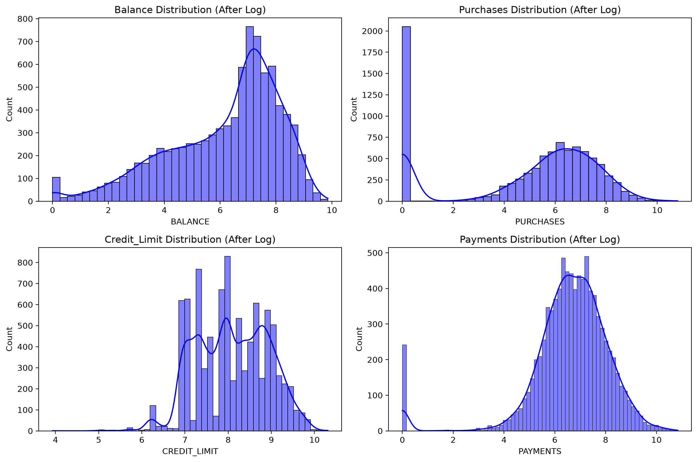
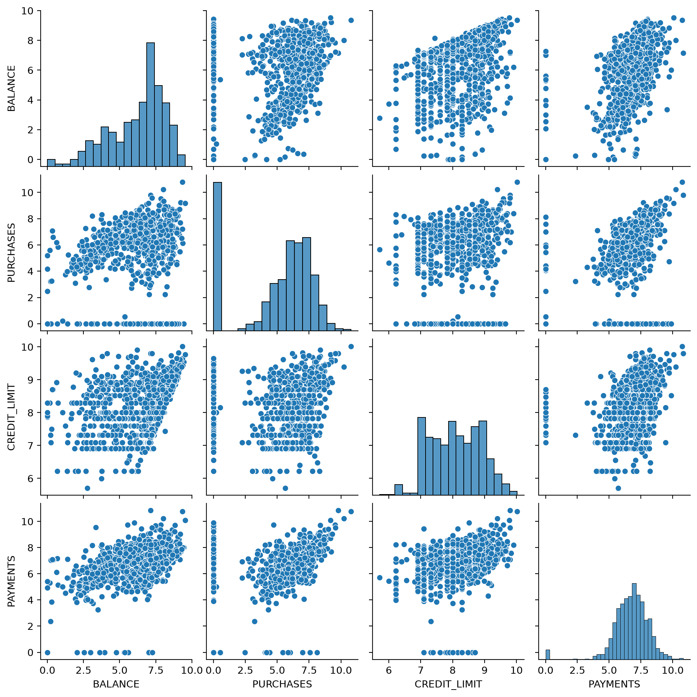
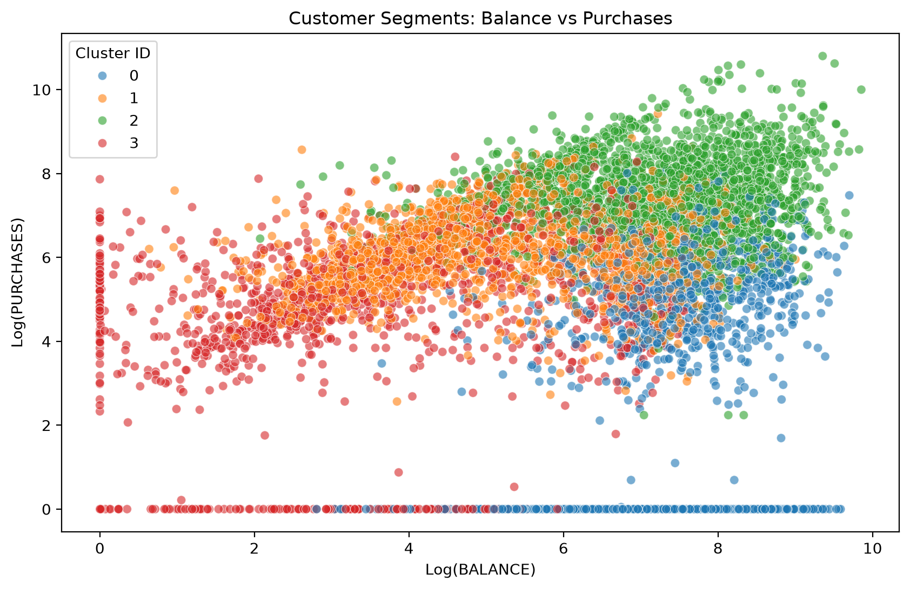

# Credit Card Customer Segmentation

Customer segmentation on credit card usage data using clustering.

I created this project to test my knowledge on what i learned from ML Specialization by Andrew NG.

## Problem
Segment ~9000 credit card holders into distinct behavioral groups based on their usage patterns (balance, purchases, cash advances, payments, etc.)

## Dataset
Source: [Credit Card Dataset for Clustering](https://www.kaggle.com/datasets/arjunbhasin2013/ccdata)

## Approach
1. First i import libraries we need and load the data
2. When loading data i use read_csv.
3. Then i observe properties of data i have, including checking for missing values and duplicates.
4. I dropped CUST_ID since it holds no behavioral information, then used KNNImputer to fill missing values based on similar customers instead of dropping rows.
5. Several features (balance, purchases, credit limit, etc.) were heavily right-skewed, so i applied log1p transformation to normalize them.
6. Then i visualized the data (heatmap, distributions, pairplot) to understand relationships and skew.
7. I used Pipeline to scale features and run KMeans automatically instead of doing it manually each time.
8. I tried PCA for dimensionality reduction, but it lowered the silhouette score, so i kept the full feature set instead.
9. I chose 4 clusters based on interpretability for customer segmentation rather than pure elbow/silhouette optimization.
10. Then i trained the model and evaluated it using silhouette, Davies-Bouldin, and Calinski-Harabasz scores.
11. Finally, i named each cluster based on its average balance/purchases/credit limit patterns to make the segments business-interpretable.

## Results

### Heatmap

### Balance-Purchase Relationship (After Log)

### Distributions of Balance, Purchases, Credit Limit and Payments

### Pair Relationship

### Customer Segment: Balance vs Purchases

### Clustering Metrics

| Metric | Value |
|--------|-------|
| Silhouette Score | 0.257 |
| Davies-Bouldin Score | 1.510 |
| Calinski-Harabasz Score | 3204.82 |

### Cluster Averages (Log-transformed)

| Cluster (label) | Balance | Purchases | Credit Limit |
|------------------|---------|-----------|----------------|
| 0 | 7.404 | 1.665 | 8.083 |
| 1 | 5.202 | 6.164 | 7.728 |
| 2 | 7.076 | 7.419 | 8.532 |
| 3 | 3.675 | 4.805 | 7.866 |

### Sample Customer Segments

| Balance | Purchases | Segment Name |
|---------|-----------|----------------|
| 3.735 | 4.569 | Budget Users |
| 8.072 | 0.000 | High Balance Passives |
| 7.823 | 6.652 | Top Spenders |
| 7.419 | 7.313 | Budget Users |
| 6.708 | 2.833 | Budget Users |
| 7.502 | 7.196 | Active Regulars |
| 6.443 | 8.867 | Top Spenders |

## Setup instruction
1. Download dataset i referenced above
2. Unzip and add it to data/ folder
3. Open new terminal inside project (can be done with 'Ctrl' + 'Shift' + '`')
4. Write 'pip install -r requirements.txt'

## Progress Log
 
| Date | Commit |
|------|--------|
| 9 July | Initializing the Project |
| 9 July | Made the Model, Trained It and added requirements.txt |
| 9 July | Finalizing Project by lastly finishing README |

## Link to other repositories i have
- [My Student Pass/Fail ML Project](https://github.com/BadalovSanan/My-StudentPassFail-ML-Project)
- [Casting Product's Deffect Detecting](https://github.com/BadalovSanan/casting-defect-logistic-regression)
- [Concrete Strength Linear Regression](https://github.com/BadalovSanan/concrete-strength-linear-regression/blob/main/README.md)